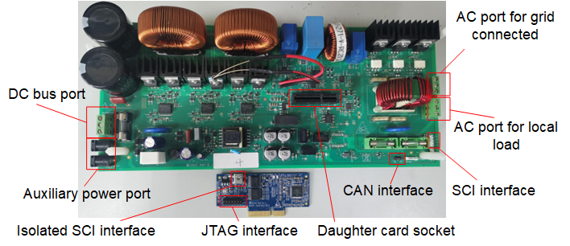

# NXP Application Code Hub

## AN14354: Multi-mode bidirectional AC-DC converter design using MC56F83783

This is a multi-mode bidirectional AC-DC converter reference design using MC56F83783 DSC.

The 56F83783 microcontroller is a member of the 32-bit 56800EX core-based Digital Signal Controllers (DSCs). Each device in the family combines, on a single chip, the processing power of a 32-bit DSP and the functionality of a microcontroller with a flexible set of peripherals. Due to its cost-effectiveness, configuration flexibility, and compact program code, 56F8xxxx is well-suited for many consumer and industrial applications.

Please refer to [AN14354](https://www.nxp.com/webapp/sps/download/preDownload.jsp?render=true) for complete instructions on how to use this software. 

#### Boards: Custom Board
#### Categories: Power Conversion
#### Peripherals: ADC, GPIO, PWM, TIMER
#### Toolchains: CodeWarrior

## Table of Contents
1. [Software](#step1)
2. [Hardware](#step2)
3. [Setup](#step3)
4. [Results](#step4)
5. [FAQs](#step5) 
6. [Support](#step6)
7. [Release Notes](#step7)

## 1. Software
- [SDK for MC56F83783: 2.13.1](https://mcuxpresso.nxp.com/en/builder?hw=MC56F83783&rel=677)
- [MCUXpresso Config Tools: v13.1](https://www.nxp.com/design/design-center/software/development-software/mcuxpresso-software-and-tools-/mcuxpresso-config-tools-pins-clocks-and-peripherals:MCUXpresso-Config-Tools)
- [CodeWarrior: 11.1](https://www.nxp.com/design/design-center/software/development-software/codewarrior-development-tools/downloads:CW_DOWNLOADS)
- [FreeMASTER:latest](https://www.nxp.com/design/design-center/software/development-software/freemaster-run-time-debugging-tool:FREEMASTER)

## 2. Hardware
- Power board: Bidirectional ACDC Converter Main Board Rev B1
- Control card: [HVP-56F83783](https://www.nxp.com/part/HVP-56F83783) Rev A&A1
- Personal computer

## 3. Setup
1. Download the firmware to the control chip by connecting a debugger (P&E-Multilink) to SWD port of the control card using a 14-pin cable.
2. Plug in the control card, connect the input voltage and load to setup the development enviroment, and using FreeMASTER by connecting the micro interface on the control card to the PC through a micro USB cable.
3. Input power on, select the desired working mode and start the converter in FreeMASTER, then the system starts working.

Please refer to [AN14354](https://www.nxp.com/webapp/sps/download/preDownload.jsp?render=true) chapter 5 for complete instructions on how to setup in different working modes.

## 4. Results
Please refer to [AN14354](https://www.nxp.com/webapp/sps/download/preDownload.jsp?render=true) chapter 5 for test results of this design.

## 5. FAQs
**5.1 Which operating modes does this design implement ?**

- AC-to-DC: totem-pole PFC
- DC-to-AC: stand-alone and grid-connected mode
- Smoothe transition between AC-to-DC and DC-to-AC mode
- Smoothe transition between stand-alone and grid-connected mode in DC-to-AC mode

**5.2 How does the AC-DC converter connect to the post-stage DC-DC to work?**

- Connect the DC bus port to the subsequent DC-DC input.
- Connect the communication port. J5 on the AC-DC board is a reserved UART communication port for communication with the subsequent DC-DC.

**5.3 How to use FreeMASTER to control the system?**

Get a basic idea of FreeMASTER with [FreeMASTER User Guide](https://www.nxp.com/docs/en/user-guide/FMSTERUG.pdf). Go to [NXP community FreeMASTER Support Portal](https://community.nxp.com/t5/FreeMASTER/bd-p/freemaster) or [FreeMASTER landing page](https://www.nxp.com/freemaster) for more information if desired.

## 6. Support

#### Project Metadata
<!----- Boards ----->

<!----- Categories ----->

<!----- Peripherals ----->
   

<!----- Toolchains ----->

Questions regarding the content/correctness of this example can be entered as Issues within this GitHub repository.

>**Warning**: For more general technical questions regarding NXP Microcontrollers and the difference in expected funcionality, enter your questions on the [NXP Community Forum](https://community.nxp.com/)

## 7. Release Notes
| Version | Description / Update                           | Date                        |
|:-------:|------------------------------------------------|----------------------------:|
| 1.0     | Initial release on Application Code Hub        | Sep 3th 2024 |

